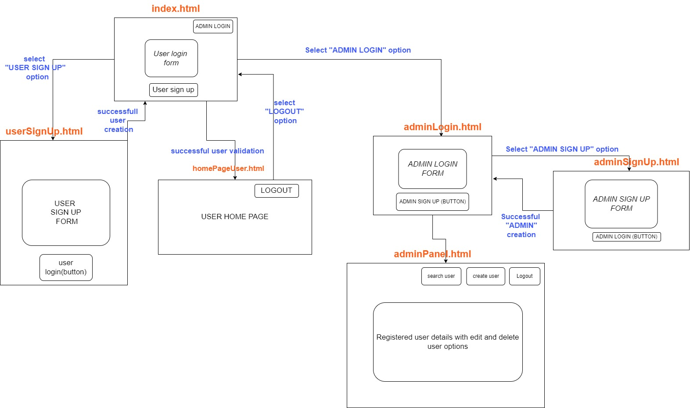

# User management system built using Go

### Prerequisites and frameworks used

1. A good understanding about fundamentals in go.
2. Gin  
3. GORM 
4. PostgreSQL database
5. JWT
6. Bcrypt

## Steps I followed to create this project

#### Step 1 : Create the front end side of the project. Do the system design part.

- Completed the system design process with a diagram built with the draw.io
- Created the front end html pages.

<!--  -->

#### Step 2 : Initialize the module

- `go mod init github.com/mohamedfawas/user-management-system`

#### Step 3 : Install the required frameworks

- `go get -u github.com/gin-gonic/gin`
- `go get -u gorm.io/gorm`
- `go get -u gorm.io/driver/postgres`
- `go get github.com/gin-contrib/cors`
- `go get github.com/joho/godotenv`
- `go get golang.org/x/crypto/bcrypt`
- `go get github.com/golang-jwt/jwt/v5`

#### Step 4 : Project directory structure plan

#### Step 5 : 